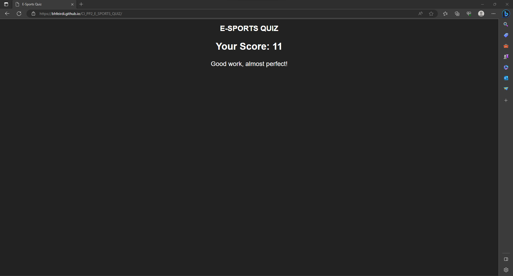
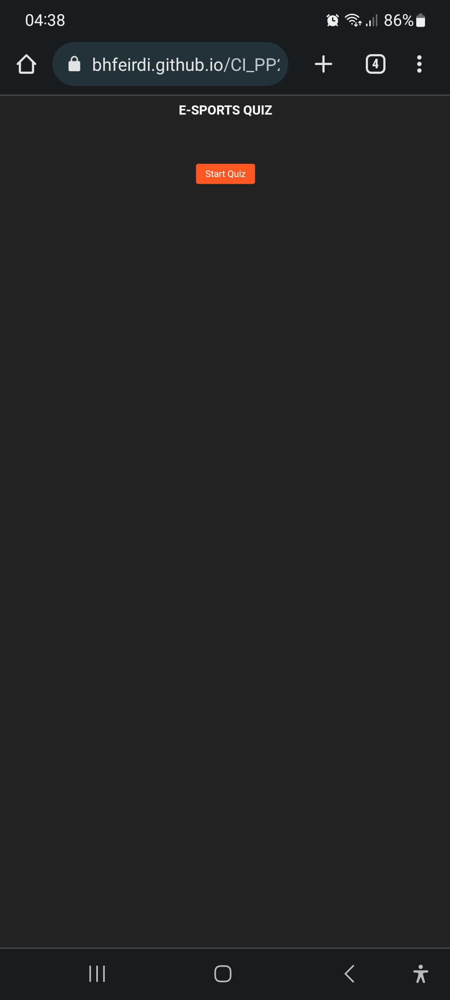
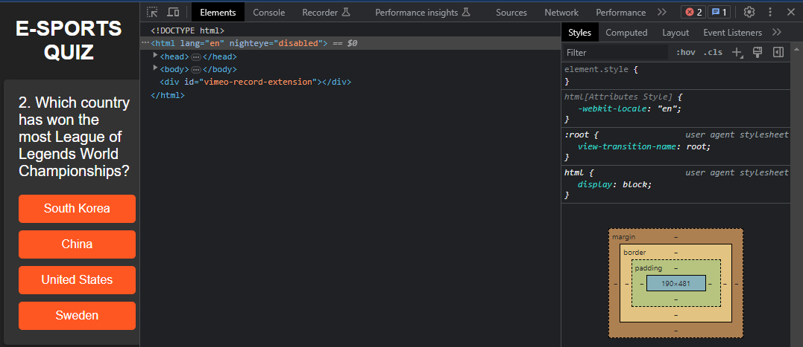
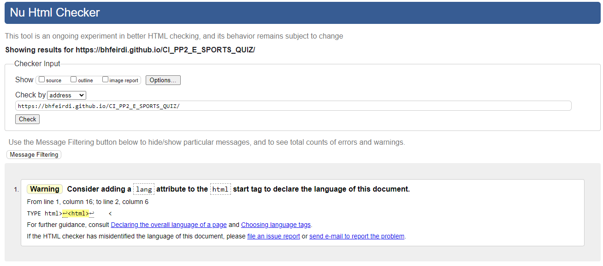
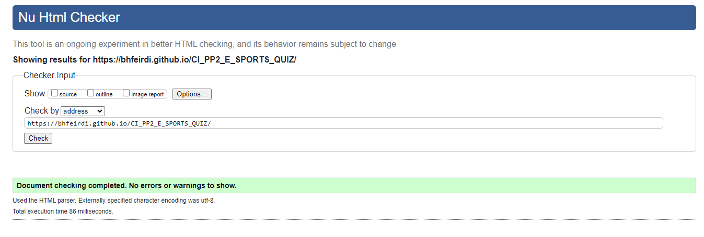
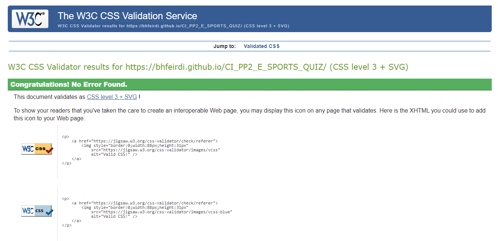
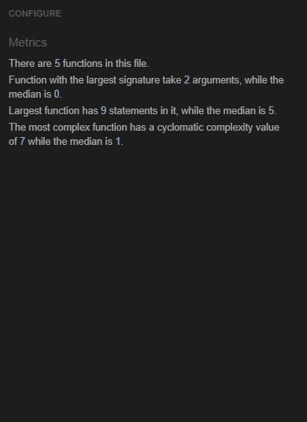
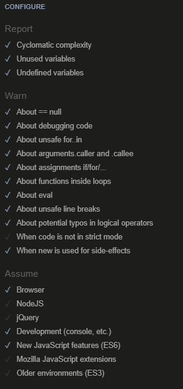
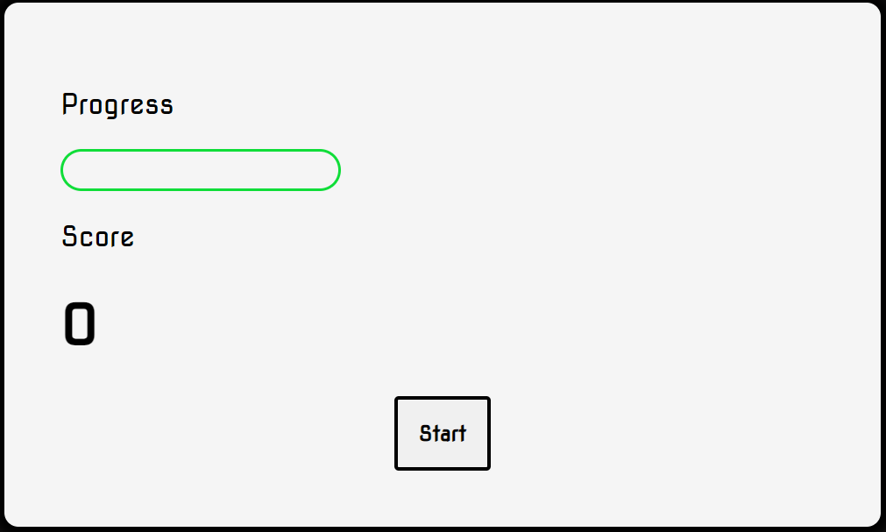

# CI_PP2_E_SPORTS_QUIZ
An interactive E-Sports quiz to showcase some learnings in Javascript. The goal of the site is to provide a challenging quiz to entertain online users.

The E-Sports Quiz is a simple game put together to test your knowledge of the world of E-Sports. A set of 20 questions with multiple choice answers with a tactile response and feel to test
just how deep in you really are!

## Features 

Some of the features we wanted to hightlight here include:

-A score tracking system

-Feedback on result

-Tactile response for the player

- __A score tracking system__

  - Over a number of iterations, which I'll touch on in bugs, it was settled on a discreat score tracking system that would give your result only at the end of the quiz. The idea
  being that you could always come back and attempt to beat your score.

- __Feedback on result__

  - We also wanted to give feedback on your given score to perhaps encourage you to try again were you not hasppy with the result. you can see how the response if built to be different dependind your your result.

- __Tactile response for the player__

  - We wanted the quiz to feel a little more tacil than simply a checklist. To aid in this we added some colour changed to the multiple choice buttons to help you feel your effecting the game.

### Features Left to Implement

- I would have liked to include some audio to accompany the quiz at the end along side your result. 

## Testing 

The quiz was tested on the following browsers and devices:

Alienware Desktop PC

Google Chrome:

Opera:

Edge:

Samsung Galaxy S21 Edge

Landscape:

Portrait:

Fully Responsive dow to 190px:

### Validator Testing 

- HTML
    - One initial error found relating to language [W3C validator]
    

    - Error corrected and no further errors were returned when passing through the official [W3C validator]
    

- CSS
    - No errors were found when passing through the official [(Jigsaw) validator]
    

- JavaScript
    - No errors were found when passing through the official [Jshint validator]
      - The following metrics were returned: 
      - There are 5 functions in this file.
      - Function with the largest signature takes 2 arguments, while the median is 0.
      - Largest function has 9 statements in it, while the median is 5.
      - The most complex function has a cyclomatic complexity value of 7 while the median is 1.
      
      

### Unfixed Bugs

In an earlier build of the web app, there was a progress bar that moved across as you answered correctly. Unfortunately I was unable to have it operate correctly
and stop with the end of the quiz. Ultimately it was scraped in favour of the score counter at the end of the game. You can see an image of it being developed below. 

## Deployment 
- The site was deployed to GitHub pages. The steps to deploy are as follows: 
  - In the GitHub repository, navigate to the Settings tab 
  - From the source section drop-down menu, select the Master Branch
  - Once the master branch has been selected, the page will be automatically refreshed with a detailed ribbon display to indicate the successful deployment. 

The live link can be found here - https://bhfeirdi.github.io/CI_PP2_E_SPORTS_QUIZ/

## Credits 

A considerable amount of inspiration for how the quiz would ultimately operate came from "Web Dev Simplified", a Youtube chanel that build various small apps and offers other coding
tips and tricks. Please find the link to the specific video here: https://www.youtube.com/watch?v=riDzcEQbX6k&t=1198s&ab_channel=WebDevSimplified

### Media

- All images were gathered by myself on my own machines for the purposes of testing and documentation. No copywrite images were used.
